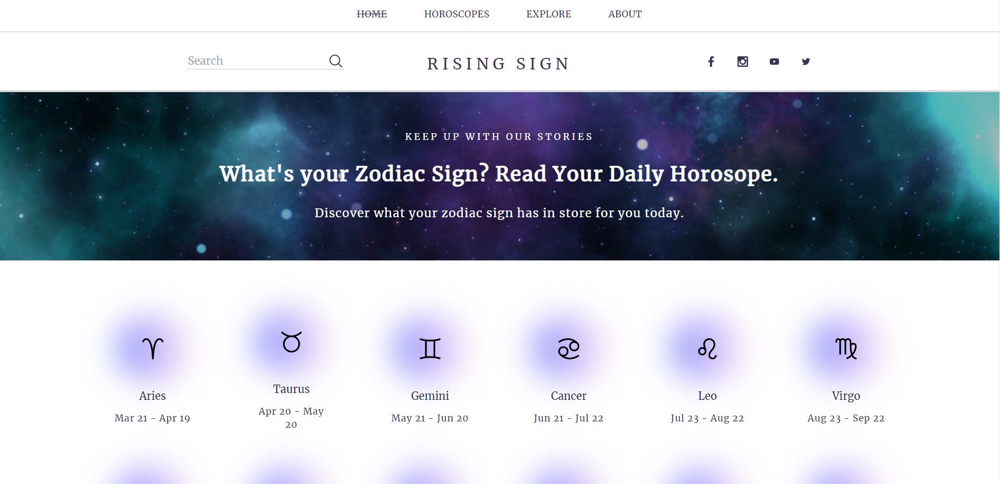

# Rising Sign - Horoscope App



The Horoscope App is a React-based web application that allows users to view free daily horoscopes based on their star sign. The app uses [Twin Flame Horoscope API](https://github.com/TwinFlame-Development/horoscopeAPI) to fetch horoscope data and displays it in a user-friendly format.

View the App Live: [https://risingsign.netlify.app/](https://risingsign.netlify.app/)

## Getting Started

To run the app locally follow the steps below:

- Git clone the repository by pasting the following into your terminal:

```bash
  git clone https://github.com/nsstarr/react_rising_sign_horoscopes.git
```
To get started with the Horoscope App, you will need to have Node.js and npm installed on your machine. Once you have those installed, you can run the following commands:

```bash
 npm i
 npm run dev
```
This will install the necessary dependencies and start the development server.

## Using the App

When you first load the app, you will be prompted to enter your star sign. Once you have entered your sign, you will see a daily horoscope for that sign. You can also view horoscopes for other signs by scrolling down the Home page or heading to the Horoscopes section of the website.


The app also allows you to view horoscopes for previous and upcoming days by clicking on 'YESTERDAY'. and 'TOMORROW' on the Horoscopes page. 

The UI and UX of the app are focused on providing a calming and mystical atmosphere, with muted colors and astrology-inspired purple shades. The layout is clean and easy to navigate, with clear section headings and buttons.

## Tech Stack
The Rising Sign App is built using a number of technologies, including:

 - React
 - React Router
 - React Spring
 - Vite
 - TailwindCSS

## Contributing
If you would like to contribute to the Horoscope App, you can fork the repository and make any necessary changes. Once you have made your changes, you can submit a pull request to have your changes reviewed and potentially merged into the main codebase.

## Issues and Bug Reports

If you encounter any issues or bugs while using the Horoscope App, please submit an issue on the GitHub repository. Be sure to include a detailed description of the problem and steps to reproduce it, as well as any relevant error messages.
## License

The Horoscope App is licensed under the MIT License. You are free to use, modify, and distribute the app as you see fit, as long as you include the original license and attribution to the original authors.